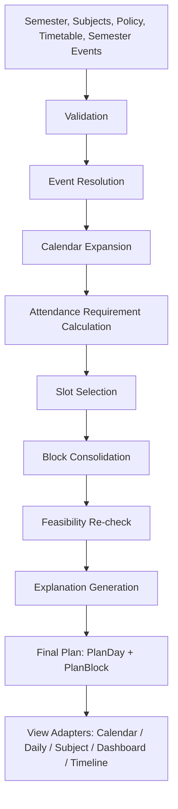

# Algorithm Design Document (ADD)
## Attendance Planner AI — Recommendation Engine

**Companion to:** `Attendance_Planner_AI_SRD.md` (v1.0), `Attendance_Planner_AI_TRD.md` (v1.0)
**Document Version:** 1.0
**Audience:** AI coding assistants implementing the `engine/` package, and the solo developer.

**Status of this document relative to the SRD/TRD:** This ADD introduces **no new requirements, no new behavior, and no architectural changes**. It is a deterministic, implementation-level explanation of the recommendation engine that is already fully specified in SRD Sections 15–17 and TRD Section 8. Wherever this document appears to add detail, that detail is an elaboration of existing SRD/TRD rules, never a new rule. If any statement here appears to conflict with the SRD or TRD, **the SRD (for behavior) and the TRD (for implementation shape) win**, and this document is in error.

This document does **not** modify the SRD or TRD and must not be used as a basis for changing them.

---

## Table of Contents

1. Purpose
2. Algorithm Goals
3. Inputs
4. Outputs
5. Algorithm Pipeline
6. Detailed Explanation of Every Stage
7. Decision Tree
8. Flowcharts
9. Mathematical Formulas
10. Pseudo Code
11. Complexity Analysis
12. Edge Cases
13. Business Rules
14. Worked Examples
15. Failure Conditions
16. Future Improvements
17. Algorithm Assumptions

---

## 1. Purpose

This document exists to make the internal behavior of the Attendance Planner AI **recommendation engine** unambiguous enough that any AI coding assistant can implement the `engine/` package (SRD Section 15, TRD Sections 8.1–8.8) from this document alone, without needing to re-derive logic or make judgment calls.

The engine is a **deterministic, rules-based scheduling algorithm** — specifically a **Greedy Slot Selection algorithm followed by a Block Consolidation post-processing pass** — that converts a student's policy, timetable, attendance history, and calendar events into a day-by-day, block-by-block Attend/Skip/Optional plan for the remainder of a semester, together with a plain-language explanation for every recommendation.

There is no machine learning, no probabilistic reasoning, no reinforcement learning, and no AI-model-based decision-making anywhere in this engine. Every output is fully traceable to an explicit numeric rule.

---

## 2. Algorithm Goals

In strict priority order (this ordering is itself a business rule — see Section 13):

1. Never produce a plan that the engine can verify violates a configured attendance minimum, if a feasible plan exists.
2. Keep every subject's projected end-of-semester attendance at or above its required minimum.
3. Keep the overall (all-subjects-combined) projected attendance at or above its required minimum.
4. Produce only continuous, physically-executable lecture blocks — never an isolated skip sandwiched between two attends.
5. Minimize the number of distinct days the student must physically visit college.
6. Minimize total hours spent on campus among equally feasible plans.
7. Produce a human-readable explanation for every single recommendation, at both block and day level.

The engine achieves these goals via a **strict lexicographic priority**: a lower-numbered goal is never sacrificed to improve a higher-numbered one. This is not a weighted-scoring or multi-objective optimization system; it is a sequence of deterministic passes, each of which can only make the plan *more* conservative (more Attend), never less.

---

## 3. Inputs

The engine consumes exactly five categories of input, all sourced from persisted entities defined in SRD Section 13 / TRD Section 6. The engine itself performs no I/O — all of the following are passed in as already-loaded, in-memory data structures (TRD Section 8, `engine/types.py`).

### 3.1 Semester
- `start_date`, `end_date` — bounds the entire planning horizon.
- Used directly by Calendar Expansion (Section 6.2) to generate the list of candidate dates.

### 3.2 Subjects
- One record per subject: `held_count`, `present_count`, and an optional `min_percentage_override`.
- `held_count` / `present_count` represent attendance **as of today**, before any future lecture is counted.
- These are the only per-subject state the engine reads; the engine does not read subject name, code, or any other metadata for decision-making (name is used only in the Explanation Generator's output strings).

### 3.3 Attendance Policy
- `min_overall_percentage` — semester-wide default floor.
- `min_subject_percentage` — default per-subject floor, overridable per subject via `min_percentage_override`.
- These values are hard constraints (Goal 1/2/3, Section 2) — never soft preferences.

### 3.4 Timetable
- A recurring weekly structure: for each weekday, an ordered list of `TimetableSlot`s (`subject_id`, `start_time`, `end_time`, `order_index`).
- The timetable is treated as identical every week for the remainder of the semester **except** where a resolved Semester Event overrides it (Section 3.5).
- `order_index` is what makes "sandwiched" detection in Block Consolidation (Section 6.5) well-defined — the engine never infers adjacency from wall-clock time gaps beyond what `order_index` and contiguity already encode.

### 3.5 Semester Events
- An unlimited list of user-defined events, each already resolved (Section 6.1) to exactly four booleans: `cancels_lectures`, `counts_towards_attendance`, `is_working_day`, `exclude_from_recommendation`.
- The engine never inspects an event's name, type label, or custom label. This is a hard design invariant (SRD FR-5c) — it is what makes the engine agnostic to any current or future event type without a code change.

There is no sixth input. In particular, there is no user-supplied "preference" weighting, no historical trend data, and no external calendar feed in the MVP engine — all of that is out of scope per SRD Non-Goals and Section 25 (Future Roadmap).

---

## 4. Outputs

### 4.1 Calendar (per-day view)
For every date in the planning horizon, a record indicating whether it is a lecture day at all, and if so, its list of blocks. Non-lecture days (fully excluded by an event) are retained as records with an empty block list so the UI can render them as excluded/grayed rather than silently omitting them.

### 4.2 Plan Blocks
The atomic recommendation unit. Each `PlanBlock` is a maximal run of time-contiguous, same-status slots within a single day: a `start_time`, `end_time`, an ordered list of `subject_ids`, a status (`Attend` / `Skip` / `Optional`), and a block-level explanation string. A block never spans two different recommendation outcomes and never spans two different days.

### 4.3 Subject Recommendations
A per-subject rollup: required percentage, total remaining future lectures, minimum lectures still needed to attend (`need_attend`), whether the target is feasible, and the best achievable percentage if not.

### 4.4 Dashboard
An aggregate summary combining the overall feasibility verdict with per-subject feasibility, current vs. required percentage, and the count of remaining "safe skips" per subject — all derived from the same `RequirementResult` data used internally, with no separate computation path.

### 4.5 Explanation
A human-readable string attached at both the block level and the day level (an aggregation of that day's block-level reasons), generated entirely from a fixed template set (Section 6.6) with numeric/name substitution only — never free-form generation.

---

## 5. Algorithm Pipeline

This is the exact sequence specified in SRD Section 11 and implemented as `engine/pipeline.py` in TRD Section 8.8. Every stage is a pure function; the pipeline is a straight-line composition with no branching between stages (branching happens only *within* a stage).

```
User Input (Semester, Subjects, Policy, Timetable, Semester Events)
        │
        ▼
Validation                         (SRD Section 19 — outside engine scope, precondition)
        │
        ▼
Event Resolution                   (Section 6.1)
        │
        ▼
Calendar Expansion                 (Section 6.2)
        │
        ▼
Attendance Requirement Calculation (Section 6.3)
        │
        ▼
Slot Selection                     (Section 6.4)
        │
        ▼
Block Consolidation                (Section 6.5)
        │
        ▼
Feasibility Check                  (part of Section 6.3's output, re-verified here)
        │
        ▼
Explanation Generation             (Section 6.6)
        │
        ▼
Final Plan (PlanDay[] with PlanBlocks, persisted, then rendered via View Adapters)
```

Validation is a precondition enforced by the API/schema layer (SRD Section 19) before the engine ever runs; the engine assumes it receives already-valid data and does not re-validate business rules such as "present ≤ held."

---

## 6. Detailed Explanation of Every Stage

### 6.1 Event Resolution

**Purpose:** Convert every `SemesterEvent`, each of which may or may not override its `EventTypeDefinition`'s defaults, into a single fully-resolved tuple of four booleans that every downstream stage can consume uniformly.

**Inputs:** List of `SemesterEvent` rows; map of `EventTypeDefinition` by id.

**Outputs:** List of `ResolvedEvent` — `(id, start_date, end_date, cancels_lectures, counts_towards_attendance, is_working_day, exclude_from_recommendation)`.

**Rules:**
- For each of the four flags independently: effective value = the event's own override column if it is non-null, else the linked `EventTypeDefinition`'s default value for that flag.
- The event's `name`, `event_type`, and `custom_type_label` are read only for the Explanation Generator's later string output (Section 6.6) — never for this stage's logic or any downstream branching.

**Complexity:** O(N) where N = number of Semester Events. Each event is resolved independently in constant time.

**Edge Cases:**
- An event of type "Other/Custom" with no overrides set falls back to the "custom" preset's conservative defaults (cancels lectures, excluded from recommendation) — this is a property of the seeded preset data, not special-cased logic in this stage.
- Multiple events are resolved independently here; **cross-event conflict resolution** (two events disagreeing on the same date) is not this stage's job — it happens in Calendar Expansion (Section 6.2), because resolution is per-event, while conflict is a per-date property.

---

### 6.2 Calendar Expansion

**Purpose:** Turn the semester's date range and the recurring weekly timetable into a concrete, day-by-day list of what lectures actually occur on each date, after accounting for every resolved event.

**Inputs:** `SemesterProfile` (start/end date), list of `TimetableSlotRef` (recurring weekly), list of `ResolvedEvent`.

**Outputs:** List of `CalendarDay`, one per date in `[start_date, end_date]`, each carrying: `date`, `weekday`, `is_lecture_day`, `slots` (possibly empty), `covering_event_ids`, `counts_towards_attendance`, `is_working_day`.

**Rules (evaluated per date):**
1. Determine `weekday` and gather all `ResolvedEvent`s whose `[start_date, end_date]` range covers this date (`covering`).
2. Compute per-flag **most-restrictive-wins** across all covering events, independently per flag:
   - `exclude = True` if **any** covering event has `exclude_from_recommendation = True`.
   - `cancels = True` if **any** covering event has `cancels_lectures = True`.
   - `counts_towards_attendance` and `is_working_day` are annotated onto the day as metadata using the same most-restrictive convention (for `is_working_day`, "restrictive" means `False` — not-a-working-day wins if any covering event says so); they do not by themselves remove slots.
3. Gather `base_slots` = every `TimetableSlot` whose `weekday` matches.
4. If `exclude` OR `cancels` is true, the day's `slots = []`. Otherwise `slots = base_slots`.
5. `is_lecture_day = (not exclude) AND (slots is non-empty)`.
6. A day with `is_lecture_day = False` is **terminal** for planning: it produces no `PlanBlock`s in any later stage, but the `CalendarDay` record itself is still retained (so the UI can render it as excluded and show which event(s) caused that).

**Complexity:** O(D × E), where D = number of days in `[start_date, end_date]` (≤ ~180 in practice) and E = number of Semester Events (≤ ~30 in practice). This is because each day must be checked against every event for range coverage. Well under 10,000 elementary operations for realistic inputs.

**Edge Cases:**
- Two events cover the same date with conflicting flags → most-restrictive wins per flag, independently (Rule 2 above); this can produce a day where, e.g., `exclude = True` from one event even though another overlapping event on the same date would individually have allowed lectures.
- A weekday with zero `TimetableSlot`s (e.g., no Saturday classes) simply produces `is_lecture_day = False` with `slots = []` and no covering events — this is a normal outcome, not an error.
- An event's date range extends past `semester.end_date` — Calendar Expansion only ever iterates dates inside `[start_date, end_date]`, so the portion of the event beyond `end_date` is naturally never visited; no special-case code is needed.

---

### 6.3 Attendance Requirement Calculation

**Purpose:** For every subject, and once in aggregate for the overall percentage, compute the minimum number of the subject's *future* lectures the student must attend to reach the configured minimum by the end of the semester — and determine whether that minimum is even achievable.

**Inputs:** List of `Subject` (with `held_count`, `present_count`, optional `min_percentage_override`); list of `CalendarDay` (already lecture-day-filtered, from Section 6.2).

**Outputs:** One `RequirementResult` per subject — `(subject_id, required_percentage, total_future_lectures, need_attend, is_feasible, best_achievable_percentage)`. The same math, aggregated across all subjects, produces the overall-percentage equivalent.

**Rules:**
1. `required_percentage` = the subject's `min_percentage_override` if set, else the semester's `min_subject_percentage`.
2. `total_future_lectures` = count of this subject's slot occurrences across every `CalendarDay` with `is_lecture_day = True`.
3. Compute the smallest non-negative integer `need_attend` such that:
   `(present_count + need_attend) / (held_count + total_future_lectures) ≥ required_percentage / 100`
   (closed form given in Section 9).
4. `is_feasible = (need_attend ≤ total_future_lectures)`.
5. If feasible, `best_achievable_percentage = required_percentage` (the target itself is reachable exactly at the floor by construction of `need_attend`, and may be exceeded if more are attended). If **not** feasible, `best_achievable_percentage` is recomputed assuming **all** remaining lectures are attended: `(present_count + total_future_lectures) / (held_count + total_future_lectures) × 100`, and `need_attend` is still exposed (even though it exceeds `total_future_lectures`) so downstream stages know to mark every remaining occurrence as required.
6. The identical calculation, run once more with subject-level counts summed into a single overall present/held/future triple, produces the overall-attendance requirement.

**Complexity:** O(S × F), where S = number of subjects (≤ ~10 typical) and F = total remaining slot occurrences across the calendar (≤ ~1,000 typical). Each subject's `total_future_lectures` requires one scan of the calendar's slots; this is trivial at MVP scale.

**Edge Cases:**
- `held_count = 0` (brand-new subject / new student): the formula still applies unchanged — `present_count` is also 0, and the entire requirement is projected purely from future lectures.
- Target mathematically infeasible even attending 100% of remaining lectures: `is_feasible = False`; the subject is still assigned `need_attend = total_future_lectures` effectively (every remaining occurrence becomes an Attend candidate per Rule 5's fallback), and the Dashboard surfaces the `best_achievable_percentage` instead of a false guarantee.
- `total_future_lectures = 0` (subject has no more scheduled occurrences, e.g., dropped elective, or semester effectively over for that subject): `need_attend` collapses to `max(0, present-vs-required gap)` compared against zero future slots, which is trivially infeasible unless `present_count / held_count` already meets `required_percentage`, in which case `need_attend = 0` and `is_feasible = True` by construction.

---

### 6.4 Slot Selection

**Purpose:** Walk the remaining calendar in chronological order and give every individual lecture slot a preliminary `Attend` / `Skip` mark, using each subject's `need_attend` (Section 6.3) as a running budget.

**Inputs:** List of `CalendarDay` (chronological order); map of `subject_id → RequirementResult`.

**Outputs:** List of `DaySelection`, one per calendar day, each holding an ordered list of `SlotMark` (`slot`, `mark ∈ {Attend, Skip}`).

**Rules:**
1. Initialize, per subject: `remaining_need = need_attend`, `remaining_occurrences = total_future_lectures`.
2. Process calendar days strictly in date order. Non-lecture days produce an empty `DaySelection` and do not affect any subject's counters.
3. Within a lecture day, process slots in their existing order (`order_index`). For each slot belonging to subject `s`:
   - `must_attend = (remaining_occurrences[s] ≤ remaining_need[s])`.
   - Mark = `Attend` if `must_attend`, else `Skip`.
   - Decrement `remaining_occurrences[s]` by 1 (always).
   - If marked `Attend`, also decrement `remaining_need[s]` by 1.
4. This produces a **greedy, front-loaded Skip allocation**: for any subject with `slack = total_future_lectures − need_attend > 0`, the algorithm consumes that slack by marking the **earliest** `slack` occurrences as `Skip` candidates, and every occurrence from the point where `remaining_occurrences == remaining_need` onward as `Attend`. This is a direct, mechanical consequence of the comparison in Rule 3 — no separate "deficit score" or heuristic ranking is computed; the single inequality is sufficient and fully deterministic.

**Complexity:** O(F), a single linear pass over all remaining slot occurrences (≤ ~1,000 typical), since each slot is visited exactly once and counter updates are O(1).

**Edge Cases:**
- `remaining_need[s] = total_future_lectures[s]` (no slack at all, i.e., subject must attend every remaining occurrence): every occurrence is marked `Attend` from the first day onward — the inequality in Rule 3 is true on every visit.
- `remaining_need[s] = 0` (subject already meets target with zero further attendance required): every occurrence is a `Skip` candidate at this stage; whether it survives as `Skip` in the final plan is decided by Block Consolidation (Section 6.5), not here.
- A subject removed from the timetable mid-semester simply stops appearing in `slots` for dates after its removal — its counters are frozen at whatever value they reached, with no special-case branch required.

---

### 6.5 Block Consolidation

**Purpose:** Enforce the mandatory rule that a student is never asked to skip a single lecture sandwiched between two lectures they must attend on the same day — because that is not a physically sensible instruction (it would require leaving and re-entering a classroom). This stage converts individually-marked slots into final, contiguous `PlanBlock`s.

**Inputs:** List of `DaySelection` (from Section 6.4), each with its ordered `SlotMark` list.

**Outputs:** List of `PlanDayResult`, each with a list of `PlanBlock`s (`start_time`, `end_time`, `subject_ids`, final `mark`, `forced` flag on affected slots).

**Rules:**
1. Process each day's slot marks independently (no cross-day consolidation — a "block" never spans two dates, per SRD assumption).
2. Repeat until no change occurs in a full pass: for every interior slot `i` (i.e., not first or last in the day), if `mark[i] = Skip` and `mark[i-1] = Attend` and `mark[i+1] = Attend`, upgrade `mark[i]` to `Attend` and flag it `forced = True`.
3. This upgrade can cascade: upgrading one sandwiched Skip can create a new sandwich situation for a neighboring slot, which is why Rule 2 repeats to a fixed point rather than running a single pass.
4. Once no more upgrades are possible, merge consecutive slots that share the same final `mark` into a single `PlanBlock` spanning from the first slot's `start_time` to the last slot's `end_time`, with `subject_ids` listed in slot order.
5. A block is finalized as `Skip` only if every slot in it is an unforced Skip with no `Attend` slot immediately before or after it within the same day.
6. Block Consolidation can only ever convert `Skip → Attend`; it never converts `Attend → Skip`. Consequently, running this stage can only preserve or improve overall projected feasibility relative to Slot Selection's output — it never makes a previously-feasible plan infeasible.

**Complexity:** O(D × K²) worst case per day, where K = slots in that day (typically ≤ 8), because the fixed-point sweep re-scans the day on every change. In practice this converges within at most K passes, making it effectively O(D × K) for realistic timetables.

**Edge Cases:**
- All slots in a day are already `Attend`: the loop makes zero changes; the whole day merges into a single `Attend` block.
- All slots in a day are `Skip` with no `Attend` slot at all: no sandwich condition can ever trigger; the day merges into a single `Skip` block.
- A `Skip` slot at the very start or end of the day's slot list is never eligible for forcing, regardless of what follows/precedes it, because Rule 2 only examines interior slots — this is what allows a subject to be safely skipped when it's the first or last lecture of the day even if other lectures that day are `Attend`.

---

### 6.6 Explanation Generator

**Purpose:** Attach a deterministic, human-readable reason string to every `PlanBlock` (and an aggregated paragraph per day) so every recommendation is auditable by the student.

**Inputs:** Consolidated `PlanBlock`s (Section 6.5); `RequirementResult`s (Section 6.3, for current/required percentages); `CalendarDay` metadata (for excluded-day reasons).

**Outputs:** Every `PlanBlock` annotated with a non-null explanation string; every `PlanDay` annotated with an aggregate explanation paragraph.

**Rules — template selection (mutually exclusive, checked in this order):**
1. If the block's date is a non-lecture day due to an event → `EVENT_EXCLUDED` template, naming the covering event(s).
2. Else if the block is `Attend` and at least one of its subjects has `remaining_need > 0` for that occurrence (i.e., it was individually required, not merely forced) → `BELOW_THRESHOLD` template for that subject.
3. Else if the block is `Attend` purely because Block Consolidation forced it (`forced = True` on all its slots, none individually required) → `BLOCK_FORCED` template.
4. Else (block is `Skip`) → `SAFELY_ABOVE` template.
5. A day-level explanation is the concatenation/aggregation of its blocks' explanations into one readable paragraph — no new information is synthesized at the day level.

**Complexity:** O(B), where B = total number of `PlanBlock`s across the plan (bounded by total slots, so ≤ ~1,000). Each block's template lookup and substitution is O(1).

**Edge Cases:**
- A block spans multiple subjects (e.g., a forced-Attend block containing one individually-required subject and one merely-forced subject): the `BELOW_THRESHOLD` reason for the required subject takes precedence in the block's headline explanation (Rule 2 before Rule 3), since it is the more actionable/urgent reason; the forced subject's rationale can still be surfaced at the per-slot level within the block if the UI chooses to.
- Never free-form text generation: all four templates are fixed strings with `.format()`-style substitution only, so output is exactly reproducible for the same input every time.

---

## 7. Decision Tree

This tree operates **per slot**, during Slot Selection (Section 6.4), and is then subject to the Block Consolidation override (Section 6.5) which can change a `Skip` leaf into `Attend` after the fact.

```
For slot belonging to subject S, on the current day in chronological processing order:
│
├── Is remaining_occurrences[S] ≤ remaining_need[S]?
│   │
│   ├── YES → Mark = ATTEND (individually required)
│   │         └── decrement remaining_occurrences[S] and remaining_need[S]
│   │
│   └── NO  → Mark = SKIP (candidate; comfortably has slack)
│             └── decrement remaining_occurrences[S] only
│
▼ (after all slots in the day are marked)
Block Consolidation pass over the day's marks:
│
├── Is this a SKIP slot with ATTEND immediately before AND ATTEND immediately after (same day)?
│   │
│   ├── YES → Upgrade to ATTEND, flag forced = true
│   │         └── Re-run the check (cascading upgrades possible)
│   │
│   └── NO  → Mark stands as originally set (ATTEND or SKIP)
│
▼
Final per-slot mark used to build PlanBlocks.
```

Feasibility (Goal 1, Section 2) is decided **earlier**, in Requirement Calculation (Section 6.3), before this tree ever runs — the tree only ever allocates *which* occurrences satisfy an already-computed, already-feasibility-checked budget. If a subject's target was infeasible, `need_attend` was set such that this tree marks essentially every remaining occurrence `ATTEND`, and the Dashboard separately surfaces the infeasibility warning — the tree itself does not need a distinct "infeasible" branch.

---

## 8. Flowcharts

### 8.1 Overall Pipeline



### 8.2 Block Consolidation

```mermaid
flowchart TD
    A[Start: day's ordered slot marks] --> B{Any interior slot i where\nmark(i)=Skip, mark(i-1)=Attend,\nmark(i+1)=Attend?}
    B -- Yes --> C[Upgrade slot i to Attend\nSet forced = true]
    C --> B
    B -- No --> D[Merge consecutive same-mark\nslots into PlanBlocks]
    D --> E[Finalize day's PlanBlocks]
```

### 8.3 Slot Selection

```mermaid
flowchart TD
    A[Initialize per subject:\nremaining_need = need_attend\nremaining_occurrences = total_future_lectures] --> B[Take next calendar day\nin chronological order]
    B --> C{Is day a lecture day?}
    C -- No --> B
    C -- Yes --> D[Take next slot in order_index]
    D --> E{remaining_occurrences(S)\n<= remaining_need(S)?}
    E -- Yes --> F[Mark = Attend\nDecrement occurrences and need]
    E -- No --> G[Mark = Skip\nDecrement occurrences only]
    F --> H{More slots in this day?}
    G --> H
    H -- Yes --> D
    H -- No --> I{More calendar days?}
    I -- Yes --> B
    I -- No --> J[All DaySelections complete]
```

---

## 9. Mathematical Formulas

Let for a given subject:
- `H` = `held_count` (lectures held so far)
- `P` = `present_count` (lectures attended so far)
- `F` = `total_future_lectures` (remaining scheduled occurrences)
- `R` = `required_percentage` (as a whole number, e.g. `75`)
- `x` = number of future lectures actually attended (the unknown the algorithm is choosing)

**9.1 Current attendance percentage**
```
current_pct = (P / H) × 100          (undefined / treated as 0 if H = 0)
```

**9.2 Projected final attendance percentage, given x future attends**
```
projected_pct(x) = (P + x) / (H + F) × 100
```

**9.3 Required lectures to attend (`need_attend`)**
Solve for the smallest integer `x ≥ 0` such that `projected_pct(x) ≥ R`:
```
(P + x) / (H + F) ≥ R / 100
x ≥ (R / 100) × (H + F) − P

need_attend = max( 0, ⌈ (R/100) × (H + F) − P ⌉ )
```

**9.4 Feasibility**
```
is_feasible  ⇔  need_attend ≤ F
```

**9.5 Best achievable percentage (only computed when infeasible)**
```
best_achievable_pct = (P + F) / (H + F) × 100
```
(This is `projected_pct(F)` — the percentage if every single remaining lecture is attended, which is the maximum possible for that subject.)

**9.6 Remaining lectures / remaining slack**
```
remaining_occurrences(S)  — count of S's not-yet-processed future slots (decreases by 1 per slot visited)
remaining_need(S)         — count of S's still-required attends not yet satisfied (decreases by 1 per Attend)
slack(S) = total_future_lectures(S) − need_attend(S)     (number of slots that may safely be Skip candidates)
```

**9.7 Overall (all-subjects) attendance**
Identical formulas (9.1–9.5) applied with `H`, `P`, `F` summed across all subjects instead of a single subject's counts.

---

## 10. Pseudo Code

### 10.1 `ResolveEvents`
```
FUNCTION ResolveEvents(events, eventTypeDefinitions)
    INPUT:  events                — list of SemesterEvent
            eventTypeDefinitions  — map from event_type_id to EventTypeDefinition
    OUTPUT: list of ResolvedEvent (id, start_date, end_date,
                                   cancels_lectures, counts_towards_attendance,
                                   is_working_day, exclude_from_recommendation)
    STEPS:
        1. CREATE empty list "resolved"
        2. FOR EACH event IN events:
             a. LOOKUP typeDef = eventTypeDefinitions[event.event_type_id]
             b. cancels     = event.cancels_lectures_override IF NOT NULL ELSE typeDef.default_cancels_lectures
             c. counts      = event.counts_towards_attendance_override IF NOT NULL ELSE typeDef.default_counts_towards_attendance
             d. working     = event.is_working_day_override IF NOT NULL ELSE typeDef.default_is_working_day
             e. excluded    = event.exclude_from_recommendation_override IF NOT NULL ELSE typeDef.default_exclude_from_recommendation
             f. APPEND ResolvedEvent(event.id, event.start_date, event.end_date,
                                      cancels, counts, working, excluded) TO resolved
        3. RETURN resolved
```

### 10.2 `ExpandCalendar`
```
FUNCTION ExpandCalendar(semester, timetable, resolvedEvents)
    INPUT:  semester        — start_date, end_date
            timetable       — list of TimetableSlot (weekday, subject_id, start_time, end_time, order_index)
            resolvedEvents  — list of ResolvedEvent
    OUTPUT: list of CalendarDay (date, weekday, is_lecture_day, slots,
                                  covering_event_ids, counts_towards_attendance, is_working_day)
    STEPS:
        1. CREATE empty list "days"
        2. FOR EACH date d FROM semester.start_date TO semester.end_date:
             a. weekday   = WEEKDAY_OF(d)
             b. covering  = ALL e IN resolvedEvents WHERE e.start_date <= d <= e.end_date
             c. excludeFlag = TRUE IF ANY e IN covering HAS e.exclude_from_recommendation = TRUE ELSE FALSE
             d. cancelFlag  = TRUE IF ANY e IN covering HAS e.cancels_lectures = TRUE ELSE FALSE
             e. countsFlag  = MOST_RESTRICTIVE(e.counts_towards_attendance FOR e IN covering) OR NULL IF covering IS EMPTY
             f. workingFlag = MOST_RESTRICTIVE_FALSE_WINS(e.is_working_day FOR e IN covering) OR NULL IF covering IS EMPTY
             g. baseSlots   = ALL s IN timetable WHERE s.weekday = weekday
             h. slots       = EMPTY LIST IF (excludeFlag OR cancelFlag) ELSE baseSlots
             i. isLectureDay = (NOT excludeFlag) AND (LENGTH(slots) > 0)
             j. APPEND CalendarDay(d, weekday, isLectureDay, slots,
                                    IDS_OF(covering), countsFlag, workingFlag) TO days
        3. RETURN days
```

### 10.3 `ComputeRequirements`
```
FUNCTION ComputeRequirements(subjects, calendarDays)
    INPUT:  subjects      — list of Subject (held_count, present_count, min_percentage_override)
            calendarDays  — list of CalendarDay (already includes is_lecture_day / slots)
    OUTPUT: list of RequirementResult (subject_id, required_percentage, total_future_lectures,
                                        need_attend, is_feasible, best_achievable_percentage)
    STEPS:
        1. CREATE empty list "results"
        2. FOR EACH subject s IN subjects:
             a. requiredPct = s.min_percentage_override IF SET ELSE semester.min_subject_percentage
             b. futureCount = COUNT of slots WHERE slot.subject_id = s.id
                              ACROSS ALL calendarDays WHERE is_lecture_day = TRUE
             c. threshold   = (requiredPct / 100) * (s.held_count + futureCount) - s.present_count
             d. needAttend  = MAX(0, CEILING(threshold))
             e. feasible    = (needAttend <= futureCount)
             f. IF feasible:
                    bestPct = requiredPct
                ELSE:
                    bestPct = ((s.present_count + futureCount) / (s.held_count + futureCount)) * 100
             g. APPEND RequirementResult(s.id, requiredPct, futureCount, needAttend, feasible, bestPct) TO results
        3. RETURN results
```

### 10.4 `SelectSlots`
```
FUNCTION SelectSlots(calendarDays, requirementsBySubject)
    INPUT:  calendarDays           — list of CalendarDay, IN CHRONOLOGICAL ORDER
            requirementsBySubject  — map from subject_id to RequirementResult
    OUTPUT: list of DaySelection (date, slotMarks: list of (slot, mark))
    STEPS:
        1. FOR EACH subject_id IN requirementsBySubject:
             remainingNeed[subject_id]        = requirementsBySubject[subject_id].need_attend
             remainingOccurrences[subject_id] = requirementsBySubject[subject_id].total_future_lectures
        2. CREATE empty list "selections"
        3. FOR EACH day IN calendarDays (chronological order):
             a. IF NOT day.is_lecture_day:
                    APPEND DaySelection(day.date, EMPTY LIST) TO selections
                    CONTINUE to next day
             b. CREATE empty list "marks"
             c. FOR EACH slot IN day.slots (ORDER BY order_index):
                    sid = slot.subject_id
                    mustAttend = (remainingOccurrences[sid] <= remainingNeed[sid])
                    mark = "Attend" IF mustAttend ELSE "Skip"
                    APPEND (slot, mark) TO marks
                    remainingOccurrences[sid] = remainingOccurrences[sid] - 1
                    IF mustAttend:
                        remainingNeed[sid] = remainingNeed[sid] - 1
             d. APPEND DaySelection(day.date, marks) TO selections
        4. RETURN selections
```

### 10.5 `ConsolidateBlocks`
```
FUNCTION ConsolidateBlocks(daySelections)
    INPUT:  daySelections — list of DaySelection (from SelectSlots)
    OUTPUT: list of PlanDayResult (date, blocks: list of PlanBlock)
    STEPS:
        1. CREATE empty list "results"
        2. FOR EACH daySelection IN daySelections:
             a. marks = COPY of daySelection.slotMarks
             b. changed = TRUE
             c. WHILE changed:
                    changed = FALSE
                    FOR i FROM 1 TO LENGTH(marks) - 2:   (interior slots only, 0-indexed)
                        IF marks[i].mark = "Skip"
                           AND marks[i-1].mark = "Attend"
                           AND marks[i+1].mark = "Attend":
                              marks[i].mark = "Attend"
                              marks[i].forced = TRUE
                              changed = TRUE
             d. blocks = MERGE_CONSECUTIVE_SAME_MARK(marks)
                          — each merged group becomes one PlanBlock with
                            start_time = first slot's start_time,
                            end_time   = last slot's end_time,
                            subject_ids = ordered list of subject_ids in the group,
                            mark        = the shared mark,
                            forced      = TRUE if ANY slot in the group has forced = TRUE
             e. APPEND PlanDayResult(daySelection.date, blocks) TO results
        3. RETURN results
```

### 10.6 `GenerateExplanations`
```
FUNCTION GenerateExplanations(planDays, requirementsBySubject, calendarDaysByDate)
    INPUT:  planDays               — list of PlanDayResult (from ConsolidateBlocks)
            requirementsBySubject  — map from subject_id to RequirementResult
            calendarDaysByDate     — map from date to CalendarDay (for excluded-day metadata)
    OUTPUT: planDays, with every block and every day annotated with an explanation string
    STEPS:
        1. FOR EACH planDay IN planDays:
             a. calDay = calendarDaysByDate[planDay.date]
             b. IF NOT calDay.is_lecture_day AND LENGTH(calDay.covering_event_ids) > 0:
                    planDay.explanation = FORMAT(TEMPLATE["EVENT_EXCLUDED"], event_names = NAMES_OF(calDay.covering_event_ids))
                    CONTINUE to next planDay
             c. FOR EACH block IN planDay.blocks:
                    IF block.mark = "Attend":
                        requiredSubject = FIRST subject IN block.subject_ids
                                          WHERE requirementsBySubject[subject].need_attend > 0
                                          AND slot for that subject in this block is NOT forced
                        IF requiredSubject EXISTS:
                            block.explanation = FORMAT(TEMPLATE["BELOW_THRESHOLD"],
                                                        subject = requiredSubject.name,
                                                        min = requirementsBySubject[requiredSubject].required_percentage)
                        ELSE:
                            block.explanation = FORMAT(TEMPLATE["BLOCK_FORCED"],
                                                        subject = NAME_OF(FIRST forced subject IN block))
                    ELSE:   (block.mark = "Skip")
                        s = FIRST subject IN block.subject_ids
                        block.explanation = FORMAT(TEMPLATE["SAFELY_ABOVE"],
                                                     subject = s.name,
                                                     current = CURRENT_PCT(s),
                                                     min = requirementsBySubject[s].required_percentage)
             d. planDay.explanation = JOIN(block.explanation FOR block IN planDay.blocks, separator = " ")
        2. RETURN planDays
```

### 10.7 `GeneratePlan` (Orchestrator)
```
FUNCTION GeneratePlan(semester, subjects, timetable, events, eventTypeDefinitions)
    INPUT:  all raw entities for one semester
    OUTPUT: PlanGenerationResult (planDays, feasibilityReport)
    STEPS:
        1. resolvedEvents = ResolveEvents(events, eventTypeDefinitions)
        2. calendarDays   = ExpandCalendar(semester, timetable, resolvedEvents)
        3. requirements   = ComputeRequirements(subjects, calendarDays)
        4. daySelections  = SelectSlots(calendarDays, INDEX requirements BY subject_id)
        5. planDays       = ConsolidateBlocks(daySelections)
        6. planDays       = GenerateExplanations(planDays, INDEX requirements BY subject_id, INDEX calendarDays BY date)
        7. feasibilityReport = BUILD FROM requirements (per-subject + overall feasible flags and best-achievable percentages)
        8. RETURN PlanGenerationResult(planDays, feasibilityReport)
```

---

## 11. Complexity Analysis

Let `D` = number of days in the remaining semester (≤ ~180 typical), `E` = number of Semester Events (≤ ~30 typical), `S` = number of subjects (≤ ~10 typical), `F` = total remaining slot occurrences across all subjects (≤ ~1,000 typical), `K` = slots per day (≤ ~8 typical).

| Stage | Time Complexity | Space Complexity | Notes |
|---|---|---|---|
| Event Resolution | O(E) | O(E) | One pass over events, constant work each. |
| Calendar Expansion | O(D × E) | O(D + E) | Each day checked against every event for coverage. |
| Requirement Calculation | O(S × F) | O(S) | Each subject scans the calendar once for its own slots. |
| Slot Selection | O(F) | O(S) for counters, O(F) for output | Single chronological pass, O(1) work per slot. |
| Block Consolidation | O(D × K²) worst case, effectively O(D × K) | O(F) for marks/blocks | Fixed-point sweep per day; converges within K passes. |
| Explanation Generation | O(B), B = total PlanBlocks ≤ F | O(B) | Constant-time template lookup and substitution per block. |
| **Overall pipeline** | **O(D × E + S × F + D × K)** | **O(D + E + S + F)** | Dominated by Calendar Expansion and Requirement Calculation at realistic scale; comfortably sub-second, satisfying the "<2 seconds" performance NFR with wide margin. |

---

## 12. Edge Cases

| # | Edge Case | Engine Handling |
|---|---|---|
| 1 | No timetable entered yet | Plan generation is blocked upstream (Section 19 validation); the engine is never invoked with an empty timetable in the normal flow. |
| 2 | No attendance history (`held_count = 0`) | Formulas (Section 9) operate correctly with `H = 0, P = 0`; requirement is projected purely from future lectures. |
| 3 | Subject already above required threshold, all future lectures skippable | `need_attend = 0`; every occurrence is a Skip candidate in Slot Selection; some may still be forced Attend by Block Consolidation if sandwiched. |
| 4 | Subject below required threshold | `need_attend > 0`; Slot Selection marks the earliest occurrences Skip only while slack remains, then switches to Attend once `remaining_occurrences = remaining_need`. |
| 5 | Impossible attendance (even 100% attendance can't reach target) | `is_feasible = False`; `best_achievable_percentage` computed assuming full attendance of all remaining occurrences; engine still marks all remaining occurrences of that subject as required Attend candidates (safest fallback) and the Dashboard surfaces the warning explicitly rather than a false "safe" plan. |
| 6 | Overlapping Semester Events with conflicting flags on the same date | Most-restrictive value wins, independently per flag (Section 6.2, Rule 2). |
| 7 | Semester already finished (end date passed) / zero remaining lecture days | Calendar Expansion produces zero `is_lecture_day = True` entries; engine returns final actual percentages with no forward plan — surfaced as "Semester Complete," not an error. |
| 8 | A day has zero timetable slots (e.g., no Saturday classes) | `is_lecture_day = False`, `slots = []`; not an error, simply produces no `PlanBlock`s for that date. |
| 9 | A subject removed from timetable mid-semester | Its future occurrences simply stop appearing in Calendar Expansion output from that point forward; historical `held_count`/`present_count` are untouched. |
| 10 | An event's date range extends beyond `semester.end_date` | Calendar Expansion only iterates within `[start_date, end_date]`, so the excess portion of the event is never visited — no special handling required. |
| 11 | All remaining lectures of a subject already sufficient to hit target even if all are skipped | Same as Edge Case 3 — `need_attend = 0`; Block Consolidation may still force some to Attend. |

---

## 13. Business Rules

1. **Never violate a configured attendance minimum** if a feasible plan exists (highest priority; hard constraint).
2. **Subject-level attendance maintenance has priority over overall attendance maintenance** — a subject-specific shortfall is addressed before optimizing the aggregate number.
3. **Overall attendance maintenance has priority over block/travel optimization** — the engine will add extra Attend recommendations to satisfy the overall floor even if doing so increases campus visits.
4. **Continuous blocks only** — the engine must never leave an isolated Skip slot sandwiched between two Attend slots on the same day; such a slot is always upgraded to Attend (Block Consolidation, Section 6.5).
5. **A block never spans two calendar dates** — consolidation and adjacency checks operate strictly within a single day.
6. **Minimize the number of distinct days requiring a campus visit**, subject to Rules 1–4 — in the MVP's fixed-recurring-timetable model, this manifests primarily as fully-skippable days being marked entirely Skip rather than partial visits.
7. **Among equally feasible plans, minimize total Attend hours** — this is a tie-breaking preference only, never allowed to violate Rules 1–4.
8. **Every recommendation must carry an explanation** generated from a fixed template set — no recommendation is ever left unexplained.
9. **The engine never branches on an event's name, type label, or custom label** — only on its four resolved boolean flags. This rule is what keeps the engine correct for any future event type without a code change.
10. **Slack is always allocated to the earliest occurrences first** — the greedy algorithm marks the earliest possible Skip candidates while slack remains, then switches irreversibly to Attend for the remainder of that subject's occurrences (a direct consequence of the Section 6.4 inequality, not a separately configured preference).
11. **Block Consolidation is a one-directional upgrade path** — it can convert Skip to Attend, but it can never convert Attend to Skip. Consequently, it can only preserve or improve feasibility relative to Slot Selection's output.
12. **Infeasible subjects still receive a maximal-attendance recommendation** — when a target cannot be reached, the engine's fallback is always to recommend attending all remaining occurrences of that subject, not to give up on producing a recommendation.

---

## 14. Worked Examples

### 14.1 Example 1 — Simple Timetable, Single Subject

**Setup:**
- Subject: Physics. `held_count = 20`, `present_count = 15` → current attendance = 75%.
- Policy: `required_percentage = 75%` (subject minimum).
- Remaining semester: 10 more Physics lectures scheduled (`total_future_lectures = 10`), one per remaining lecture day, no other subjects that day (so no Block Consolidation interactions to consider).

**Step — Requirement Calculation (Section 6.3 / Section 9.3):**
```
threshold = (75 / 100) × (20 + 10) − 15
          = 0.75 × 30 − 15
          = 22.5 − 15
          = 7.5
need_attend = ceiling(7.5) = 8
is_feasible = (8 ≤ 10) = TRUE
```
Physics must attend at least 8 of the remaining 10 lectures. `slack = 10 − 8 = 2`.

**Step — Slot Selection (Section 6.4), day by day:**

| Day | remaining_occurrences (before) | remaining_need (before) | Comparison | Mark | remaining_occurrences (after) | remaining_need (after) |
|---|---|---|---|---|---|---|
| 1 | 10 | 8 | 10 ≤ 8? No | Skip | 9 | 8 |
| 2 | 9 | 8 | 9 ≤ 8? No | Skip | 8 | 8 |
| 3 | 8 | 8 | 8 ≤ 8? Yes | Attend | 7 | 7 |
| 4 | 7 | 7 | Yes | Attend | 6 | 6 |
| 5–10 | … | … | Yes (each) | Attend | … | 0 at end |

**Result:** Days 1–2 → Skip. Days 3–10 → Attend. Since each Physics day is the only slot that day, there is nothing to sandwich, so Block Consolidation makes no changes. Final projected attendance = `(15 + 8) / (20 + 10) × 100 = 76.67%`, which is ≥ 75% as required.

**Explanation generated:** Days 1–2 → `"Physics attendance is safely above threshold (75% vs 75% required); skipping reduces unnecessary campus time."` Days 3–10 → `"Physics attendance is below the required 75%. Attend to recover."` (technically at exactly the floor, the engine treats any day where `must_attend = True` as a below-threshold-style required attend, since skipping it would drop the subject below the floor).

---

### 14.2 Example 2 — DBMS / OS / Maths / EFM (Canonical Regression Example)

This is the permanent regression fixture referenced in SRD Section 29 and TRD Section 19/22. It demonstrates the interaction between Slot Selection and Block Consolidation that produces the signature "Attend 9–12, Skip EFM" outcome.

**Setup:**
- Policy: `required_percentage = 75%` for every subject (illustrative — this is a user-configured value in this example, not a hardcoded system default).
- Timetable for the day in question, in order: **DBMS (9–10)**, **OS (10–11)**, **Maths (11–12)**, **EFM (12–1)**.
- Current attendance and remaining-semester data:

| Subject | Held | Present | Current % | Future lectures (F) |
|---|---|---|---|---|
| DBMS | 50 | 31 | 62% | 30 |
| OS | 50 | 45 | 90% | 30 |
| Maths | 50 | 32 | 64% | 30 |
| EFM | 40 | 38 | 95% | 30 |

**Step — Requirement Calculation (Section 9.3) for each subject:**
```
DBMS:  threshold = 0.75 × (50+30) − 31 = 60 − 31 = 29     → need_attend = 29   (F=30, feasible, slack=1)
OS:    threshold = 0.75 × (50+30) − 45 = 60 − 45 = 15     → need_attend = 15   (F=30, feasible, slack=15)
Maths: threshold = 0.75 × (50+30) − 32 = 60 − 32 = 28     → need_attend = 28   (F=30, feasible, slack=2)
EFM:   threshold = 0.75 × (40+30) − 38 = 52.5 − 38 = 14.5 → need_attend = 15   (F=30, feasible, slack=15)
```

**Step — Slot Selection, simulated day by day (each subject occurs once per remaining lecture day):**

- **DBMS** (slack=1): Day 1 → Skip (occurrences 30 > need 29). Day 2 onward → Attend (occurrences drop to equal need and stay equal).
- **Maths** (slack=2): Days 1–2 → Skip. Day 3 onward → Attend.
- **OS** (slack=15): Days 1–15 → Skip. Day 16 onward → Attend.
- **EFM** (slack=15): Days 1–15 → Skip. Day 16 onward → Attend.

**Focus on Day 3 of the remaining semester** — the day this worked example illustrates:

| Subject | Slot | Individual mark (before consolidation) |
|---|---|---|
| DBMS (9–10) | 1st | **Attend** (day 3 is ≥ day 2, already in the Attend region) |
| OS (10–11) | 2nd | **Skip** (day 3 < day 16, still in slack region) |
| Maths (11–12) | 3rd | **Attend** (day 3 is exactly where Maths' slack of 2 runs out) |
| EFM (12–1) | 4th | **Skip** (day 3 < day 16, still in slack region) |

**Step — Block Consolidation (Section 6.5) on Day 3's marks `[Attend, Skip, Attend, Skip]`:**
- Interior slot OS (index 1): `mark = Skip`, `mark[before] = Attend` (DBMS), `mark[after] = Attend` (Maths) → **sandwich condition met** → OS upgraded to **Attend**, `forced = True`.
- Interior slot Maths (index 2) is not Skip, so no check needed there.
- EFM (last slot, index 3) has no slot after it, so it is never eligible for the sandwich rule regardless of what precedes it.
- Re-scan: no further Skip slots remain between two Attends. Loop terminates.
- Final marks: `[Attend, Attend, Attend, Skip]`.

**Merge into blocks:** DBMS+OS+Maths merge into a single contiguous **Attend block, 9:00–12:00**. EFM remains a separate **Skip block, 12:00–1:00**.

**Why the final recommendation is "Attend 9–12, Skip EFM":** DBMS and Maths are individually below their safe pace and must be attended on Day 3. OS is individually comfortable and would have been marked Skip on its own, but because it physically sits between two mandatory-attend lectures with no timetable gap, Block Consolidation upgrades it to Attend — the student cannot practically leave after DBMS and return for Maths. EFM, by contrast, is the last lecture of the day: skipping it does not require re-entering a classroom later, so it is not sandwiched, remains Skip, and is safely skippable since its own attendance (95%) is far above the 75% floor with 15 lectures of slack remaining.

**Explanations generated for Day 3:**
- DBMS block-contribution: `"DBMS attendance is below the required 75%. Attend to recover."`
- OS block-contribution: `"OS attendance is already sufficient but is included because it lies between required lectures."`
- Maths block-contribution: `"Maths attendance is below the required 75%. Attend to recover."`
- EFM: `"EFM attendance is safely above threshold (95% vs 75% required); skipping reduces unnecessary campus time."`

---

## 15. Failure Conditions

| Condition | Engine Response |
|---|---|
| **Impossible attendance** (a subject or the overall target cannot be reached even with 100% future attendance) | Engine does **not** fail or throw. It sets `is_feasible = False` for that subject/overall, computes `best_achievable_percentage`, and still returns a maximal-attendance recommendation for that subject (Business Rule 12). The API/UI layer is responsible for surfacing this as an "At Risk" warning — the engine's contract is to always return a `RequirementResult`, never to abstain. |
| **Invalid data** (e.g., `present_count > held_count`, malformed dates) | Rejected upstream by validation (SRD Section 19) before the engine is ever invoked. The engine itself performs no defensive re-validation of these invariants and assumes valid input as a precondition. |
| **Conflicting timetable** (two subjects scheduled at the same weekday/time) | Rejected upstream by validation (data-entry conflict) — the engine never receives two simultaneous slots for the same weekday/time in valid input. |
| **Invalid semester** (end date before start date, or end date already passed) | Rejected upstream by validation. If a semester has zero remaining lecture days by the time the engine runs (e.g., legitimately finished), this is not a failure — see Edge Case 7 (Section 12): the engine returns an empty forward plan with final actual percentages. |

In all cases, the engine's operating principle is: **explicit, structured infeasibility reporting is always preferred over silently returning an incorrect "safe" plan** (this mirrors the Reliability non-functional requirement in the SRD).

---

## 16. Future Improvements

The following are documented **for awareness only**. They are explicitly out of scope for the current engine and must **not** be implemented as part of this ADD. They are listed here solely so a future maintainer understands the engine's designed extension points.

- **OR-Tools-based constrained solver**: a pluggable alternative to the greedy + consolidation engine described in this document, intended for more complex timetable structures (e.g., alternating-week schedules, elective batches) that the current greedy approach handles less optimally. Would sit behind the same `engine/pipeline.py` interface described in Section 10.7, so it could be swapped in without changing the API contract.
- **OCR-based timetable/calendar ingestion**: automatic extraction of timetable and academic-calendar data from uploaded images/PDFs, feeding the same `TimetableSlot` and `SemesterEvent` structures this engine already consumes — the engine's input contract would not change.
- **Scenario simulation ("what if I skip tomorrow?")**: an ad hoc, non-persisting invocation of the same `GeneratePlan` pipeline with one mutated input day, to preview the effect of a single deviation without committing to a new plan.
- **Attendance trend prediction**: statistical projection of future attendance trajectory, layered on top of (not replacing) the deterministic requirement calculations in Section 6.3.

None of these introduce machine learning, reinforcement learning, genetic algorithms, or LLM-based reasoning into the core engine described in this document; where "intelligence" is mentioned in the wider roadmap, it refers to simple statistical projection, not opaque model-based decision-making — consistent with the SRD's explicit prohibition on paid/opaque AI dependencies.

---

## 17. Algorithm Assumptions

These mirror the SRD's stated assumptions (SRD Section 27) exactly, restated here because they are load-bearing for the engine's correctness:

- The student attends the same recurring weekly timetable every week for the remainder of the semester, except where a resolved Semester Event's flags override it for specific dates.
- Event Type presets ship with reasonable default attendance-impact flags; the engine trusts whatever flags it is given as already resolved and correct — it does not second-guess or re-derive them from an event's name or type.
- A "block" is defined purely by time-contiguity within a single day; there is no cross-day blocking anywhere in this engine.
- Attendance percentage is always computed as `present / held × 100`.
- The engine assumes attendance data (`held_count`, `present_count`) is manually maintained and reasonably up to date; there is no real-time or biometric/GPS-based attendance detection, and no automatic reconciliation — recalculation is a manual, explicit trigger.
- All lecture slots for a subject count equally toward that subject's percentage; there is no weighting by lecture type (e.g., lab vs. theory) in this engine.
- The set of weekdays considered "lecture days" is implicitly defined by which weekdays have `TimetableSlot`s entered — there is no separately configured "college week" concept.
- The timetable is static between explicit user edits; the engine does not detect or react to timetable drift on its own — a manual "Recalculate" action is required to reflect any change.

---

*End of Algorithm Design Document. This document documents existing SRD/TRD-specified behavior only; it introduces no new features and supersedes neither the SRD nor the TRD.*
