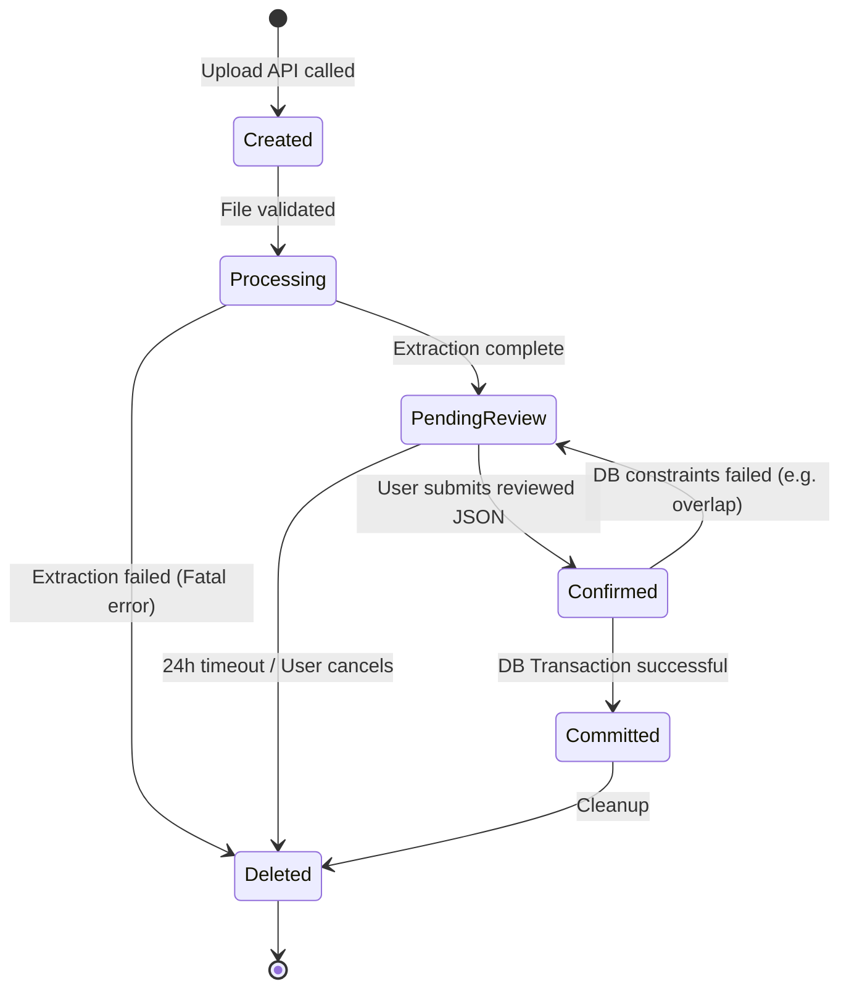

# Algorithm Design Document (ADD)
## Attendance Planner AI
**Document Version:** 1.1
**Companion to:** `Attendance_Planner_AI_ADD.md` (v1.0 baseline)

---

## 1. Document Import Algorithms

The document extraction pipelines transform unstructured binaries into highly structured candidate rows. None of these algorithms bypass user confirmation.

### 1.1 PDF Timetable Extraction
- **Input:** A `.pdf` file.
- **Pre-processing:** `pdfplumber` loads the first page (or page with the largest table) and strips non-text graphics.
- **Parsing:** `pdfplumber.extract_tables()` uses drawn lines and explicit text alignment to identify cells in a grid. 
- **Extraction:** 
  1. Identify the "Time" axis (row or column containing regex patterns like `\d{1,2}:\d{2}`).
  2. Identify the "Weekday" axis (Monday–Friday/Saturday).
  3. Iterate through intersections. A non-empty cell at `(Weekday_X, Time_Y)` yields `(Weekday_X, start_time, end_time, cell_text)`.
- **Validation:** Discard cells where `cell_text` is empty, "Lunch", "Break", or matches common non-academic keywords. Ensure `start_time < end_time`.
- **Structured Output:** List of `(weekday, start_time, end_time, subject_name, confidence)`.

### 1.2 Image Timetable Extraction (OCR)
- **Input:** A `.png` or `.jpeg` file.
- **Pre-processing:** `Pillow` converts the image to grayscale, applies Gaussian blur, and uses adaptive thresholding to maximize text contrast.
- **Parsing:** `pytesseract.image_to_data()` extracts words and their spatial bounding boxes `(left, top, width, height)`.
- **Extraction:**
  1. Cluster bounding boxes vertically to identify columns and horizontally to identify rows (K-Means or simple proximity grouping).
  2. Map the top-left-most clusters to Weekdays and Times.
  3. Reconstruct the grid and extract `subject_name` from the intersecting text blocks.
- **Validation:** Same as PDF.
- **Structured Output:** List of `(weekday, start_time, end_time, subject_name, confidence)`.

### 1.3 PDF Academic Calendar Extraction
- **Input:** A `.pdf` file.
- **Pre-processing:** `pdfplumber` extracts raw, ordered text lines.
- **Parsing:** Iterates line-by-line.
- **Extraction:**
  1. Applies a prioritized list of Date Regexes (e.g., `\b\d{1,2}(st|nd|rd|th)?\s+(Jan|Feb...)\b`, `\d{4}-\d{2}-\d{2}`).
  2. If a single date is found, `start_date = end_date = found_date`. If a range (e.g., "12th - 14th Oct") is found, split into `start_date` and `end_date`.
  3. The remaining text on the line is assumed to be the `event_name`.
  4. Compare `event_name` against known `SlotType` or `EventType` presets using Levenshtein distance to infer the event type.
- **Validation:** Ignore lines with no dates. Ignore dates falling completely outside the configured Semester bounds.
- **Structured Output:** List of `(event_name, start_date, end_date, inferred_event_type, confidence)`.

### 1.4 Image Academic Calendar Extraction (OCR)
- **Input:** A `.png` or `.jpeg` file.
- **Pre-processing:** Grayscale and binarization via `Pillow`.
- **Parsing:** `pytesseract.image_to_string()` with block layout analysis enabled (PSM 6: Assume a single uniform block of text).
- **Extraction:** The resulting string is split by newline, and the exact same Regex and Extraction heuristics from 1.3 are applied.
- **Validation:** Same as PDF.
- **Structured Output:** List of `(event_name, start_date, end_date, inferred_event_type, confidence)`.

---

## 2. Confidence Scoring Algorithm

Confidence is a `float ∈ [0.0, 1.0]` calculated per extracted row to guide the user's attention during the Review phase.

### Calculation
- **PDF Tables:** Base confidence is `0.9`. Deduct `0.2` if the cell spans multiple rows/cols. Deduct `0.2` if `subject_name` contains unusual characters (e.g., unexpected symbols).
- **OCR Images:** Base confidence relies on Tesseract's mean word-level confidence (`pytesseract` returns a 0-100 score per word). Convert to 0.0-1.0. Deduct `0.2` if grid reconstruction was ambiguous (e.g., overlapping bounding boxes).
- **Regex Calendars:** Base confidence is `0.8` if a date parses perfectly. Add `0.1` if the inferred event type is a high-confidence string match. Deduct `0.3` if only a partial/ambiguous date was found.

### Categorization (Fixed Thresholds)
- **High (≥ 0.8):** Rendered with a green/neutral background. Auto-checked for import.
- **Medium (0.5 – 0.79):** Rendered with an amber background and a warning icon.
- **Low (< 0.5):** Rendered with a red background. Requires explicit user confirmation to include.

---

## 3. Import Session State Machine

To protect the Recommendation Engine from malformed data, extraction goes through an ephemeral state machine.


- **Browser Refresh resilience:** Because the payload is saved to the DB at `PendingReview`, a user can refresh the page and resume editing without re-uploading.

---

## 4. Review & Correction Algorithm

The Review screen operates entirely on the JSON payload within the `ImportSession` until the final commit.
1. **Editing Rows:** The user mutates a row in the JSON array. The frontend immediately re-runs basic validation (e.g., `start_time < end_time`).
2. **Deleting Rows:** The row is spliced from the array.
3. **Adding Rows:** A new row is pushed to the array with `confidence = 1.0` (human-authored).
4. **Validation Before Commit:** When the user clicks "Confirm", the payload is sent to `/confirm`. The backend executes the identical validation logic used by the standard manual-entry APIs (TRD v1.0, Section 19).
5. **Strict Barrier:** The Recommendation Engine explicitly queries the `timetable_slot` and `semester_event` tables. Because unconfirmed rows only exist inside the `import_session.extracted_payload` JSON blob, they are mathematically invisible to the Engine.

---

## 5. Attendance Distribution Algorithm

V1.0 utilized a Greedy Deferral algorithm (`remaining_occurrences <= remaining_need`). V1.1 replaces this to generate realistic, distributed plans.

### Evaluation of Deterministic Approaches
1. **Weekly Budgeting:** Allocate `skips_per_week = total_slack / total_weeks`. *Flaw:* Rigid. Fails if a week has a massive holiday, stranding budget.
2. **Rolling-Window Balancing:** Look ahead N days and ensure local attendance matches the global target. *Flaw:* High complexity, edge cases around window boundaries can cause sudden clusters of skips at the semester end.
3. **Hybrid Strategy:** Mix greedy logic with weekly limits. *Flaw:* Breaks the strict deterministic guarantees and heavily complicates block consolidation.
4. **Even Spacing (Skip Interval):** Calculate the exact spacing between skips across the entire remaining timeline. *Selected Approach.*

### Why "Even Spacing" is Superior
It is computationally trivial, preserves 100% determinism, adapts perfectly to holidays (because it counts occurrences, not calendar days), and guarantees mathematical feasibility.

### The Algorithm (Even Spacing)
```python
def select_distributed(days: list[CalendarDay], requirements: dict[int, RequirementResult]) -> list[DaySelection]:
    # Initialize state
    remaining_slack = {}
    skip_interval = {}
    skip_counter = {}

    for sid, req in requirements.items():
        slack = req.total_future_lectures - req.need_attend
        remaining_slack[sid] = max(0, slack)
        # +1 ensures we don't divide by zero and places skips strictly inside the timeline
        skip_interval[sid] = req.total_future_lectures / (slack + 1) if slack > 0 else float('inf')
        skip_counter[sid] = skip_interval[sid] / 2.0  # Start midway to stagger early skips

    # Chronological traversal
    for day in days:
        if not day.is_lecture_day: continue
        for slot in day.slots:
            sid = slot.subject_id
            skip_counter[sid] += 1
            
            # Can we afford to skip?
            if remaining_slack[sid] > 0 and skip_counter[sid] >= skip_interval[sid]:
                mark = "Skip"
                remaining_slack[sid] -= 1
                skip_counter[sid] -= skip_interval[sid] # Reset counter, carrying over remainder
            else:
                mark = "Attend"
            
            # (Append mark to day)
```
*Because total skips issued can never exceed the initial `slack`, `need_attend` is mathematically guaranteed to be met by the end of the timeline.*

---

## 6. Attendance Policy Evaluation

The engine now supports generic Slot Types. The `ComputeRequirements` logic (ADD v1.0 Section 10.3) delegates math to a `PolicyEvaluator`.

### PolicyEvaluator Math
For a given subject and a specific `slot_type`:
Let $H$ = held, $P$ = present, $F$ = future occurrences.

1. **Percentage Based (`policy_value` = $R \in [0, 100]$):**
   Same as V1.0: Solve for minimum integer $x$ where $\frac{P + x}{H + F} \ge \frac{R}{100}$.
   $need\_attend = \max(0, \lceil \frac{R}{100} (H + F) - P \rceil)$

2. **Maximum Absence (`policy_value` = $M \ge 0$):**
   The student is allowed exactly $M$ absences. They have already used $(H - P)$ absences.
   $remaining\_allowed = \max(0, M - (H - P))$
   $need\_attend = \max(0, F - remaining\_allowed)$

3. **Mandatory (`policy_value` = null):**
   Equivalent to Max Absence where $M = 0$.
   $need\_attend = F$

**Integration:** The results are packed into `RequirementResult` objects keyed by `(subject_id, slot_type_id)`. The Distribution Algorithm (Section 5) runs independently per key, preserving strict determinism.

---

## 7. Error Recovery Algorithms

Extraction will fail on messy documents. The system falls back safely and deterministically:
- **OCR Failure / Unsupported Document:** The parser throws an exception. State transitions to `Deleted`. The API returns HTTP 422 with a structured error: `"Document could not be parsed. Please use Manual Entry."`
- **Empty Extraction:** Document parsed successfully, but 0 valid rows found. State transitions to `Deleted`. API returns HTTP 422: `"No timetable/calendar data found in document."`
- **Duplicate Rows:** (e.g., OCR misreads a merged cell twice). Caught during the "Confirm" transition by the standard V1.0 DB overlap constraints. The `ImportSession` remains in `PendingReview`, and the API returns a 400 error detailing the overlap, forcing the user to delete the duplicate row in the UI.

---

## 8. Complexity Analysis

| Algorithm | Time Complexity | Space Complexity | Notes |
|---|---|---|---|
| **PDF Extraction** | $O(P \times C)$ | $O(P)$ | $P$=pages, $C$=cells. Very fast, well under 1s. |
| **OCR Extraction** | $O(W \log W)$ | $O(W)$ | $W$=words detected by Tesseract. Dominated by Tesseract's internal CNN execution ($\approx 2-5$ seconds per image). |
| **Distribution Algorithm** | $O(F)$ | $O(S \times T)$ | $F$=total future slots, $S$=subjects, $T$=slot types. $O(1)$ math per slot traversal. Highly scalable. |
| **Policy Evaluator** | $O(S \times T)$ | $O(S \times T)$ | Computed exactly once before calendar traversal. Negligible cost. |

---

## 9. Determinism Review

Version 1.1 preserves the strict determinism required by the SRD:
1. **Document Import:** Given the identical byte-stream of an image/PDF, `pytesseract` and `pdfplumber` produce the exact same text boxes. The Regex and Grid-clustering algorithms contain no random variables. The generated `ImportSession` payload is 100% reproducible.
2. **Attendance Distribution:** The `skip_interval` relies purely on floating-point arithmetic. Traversing the list of `CalendarDay` objects applies state mutations (`skip_counter`) strictly sequentially. The same $F$ and $need\_attend$ will produce the identical sequence of "Attend" and "Skip" marks every single time.
3. **Policy Evaluation:** The $need\_attend$ equations (Section 6) rely exclusively on integers, constants, and deterministic ceiling/max functions.

---

## 10. Completion Criteria
- [x] Every new algorithm is fully documented.
- [x] Recommendation Engine integration is clearly defined.
- [x] Attendance Distribution algorithm is finalized and justified.
- [x] Attendance Policy algorithm is finalized.
- [x] Import workflow is deterministic.
- [x] Review & Correction logic is complete.

*End of Version 1.1 Algorithm Design Document.*
