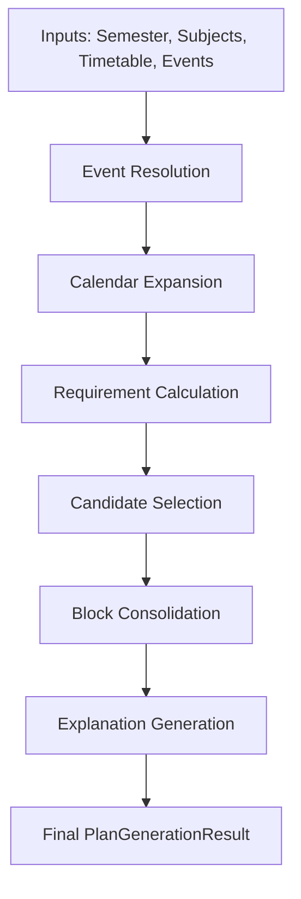

# Attendance Planner AI - Core Engine Architecture

## 1. Engine Philosophy
The Core Recommendation Engine is a deterministic, stateless, pure-Python logic module. It strictly implements the mathematics and business rules of the Attendance Planner without relying on external system states, random number generators, or database I/O. 

## 2. Pipeline and Data Flow
The engine pipeline (`generate_plan` in `pipeline.py`) accepts structured input data and processes it chronologically through five stages:

### 2.1 Event Resolution (`event_resolution.py`)
Processes `SemesterEvent` records against global `EventTypeDefinition` settings. This allows holidays to override default behavior or mid-semester exams to cancel regular lectures while remaining as working days.

### 2.2 Calendar Expansion (`calendar_expansion.py`)
Generates a complete array of `CalendarDay` objects spanning `semester.start_date` to `semester.end_date`. Each day identifies whether it is a lecture day and maps the matching `TimetableSlotRef` instances using the weekday.

### 2.3 Requirement Calculation (`requirement_calc.py`)
Determines exact mathematical feasibility for every subject. Computes the maximum possible lectures that will be held, determines the exact numerical threshold required, and flags `is_feasible` while storing the `best_achievable_percentage`.

### 2.4 Candidate Selection (`slot_selector.py`)
Implements a **Greedy Deferral Algorithm**. It evaluates every future slot chronologically with the formula:
`must_attend = remaining_occurrences <= remaining_need`
By doing so, the engine defaults to skipping early lectures when there is a large buffer of future lectures, deferring attendance until mathematically required.

### 2.5 Block Consolidation (`block_consolidation.py`)
Iterates over the day's candidate selections and implements the **Sandwich Rule**. If a "Skip" slot is wedged chronologically between two "Attend" slots, it is upgraded to an `Optional` "Attend" to prevent idle gaps in the student's day on campus. Adjacent identical recommendations are merged into continuous `PlanBlockResult` objects.

### 2.6 Explanation Generation (`explanation_generator.py`)
Determines the template explanation string (`BELOW_THRESHOLD`, `SAFELY_ABOVE`, `BLOCK_FORCED`, `EVENT_EXCLUDED`) for the resulting blocks to ensure the user receives clear deterministic reasoning.

## 3. Key Invariants
1. **Determinism:** Passing identical data structures to `generate_plan` will always yield byte-for-byte identical outputs.
2. **Eligibility Safety:** The engine does not filter for academic groups (Batches/Honors). This occurs upstream in the API layer. The engine will never invent a slot that was not explicitly passed to it.
3. **No Gaps:** Block Consolidation guarantees a student is never advised to wait on campus between two required lectures.
4. **Feasibility Honesty:** If attendance targets cannot be reached, the system correctly reports it as infeasible but continues to recommend attending all remaining lectures to maximize the final percentage.

## 4. Extension Points for Future Versions
- **Dynamic Scoring:** Currently, the engine uses strict threshold math. If "soft targets" or machine learning optimizations are requested in the future, the `slot_selector.py` can be refactored into a cost-function solver without altering the rest of the pipeline.
- **Location-Based Consolidation:** The `block_consolidation.py` could be enhanced to factor in campus locations or building transit times when evaluating the Sandwich Rule.
